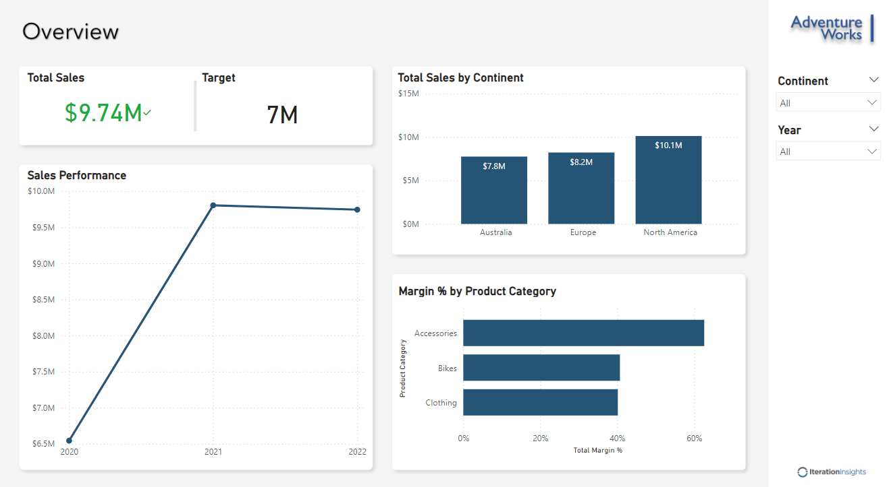
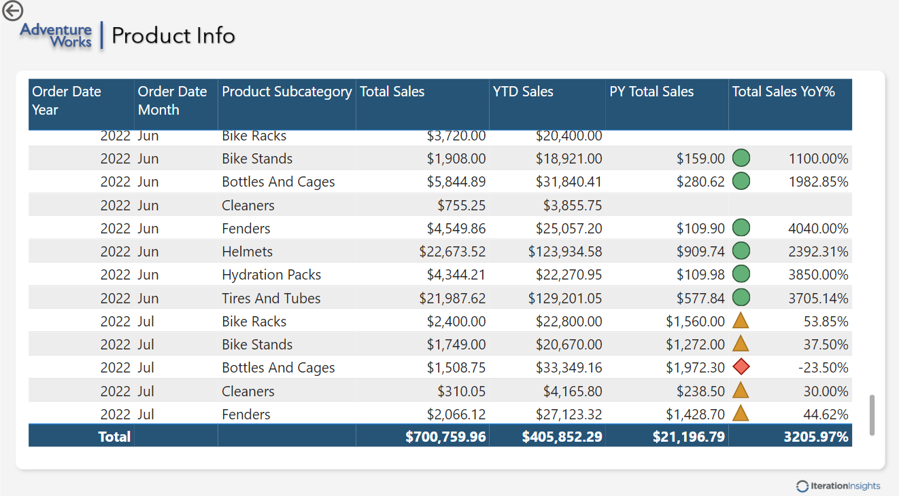
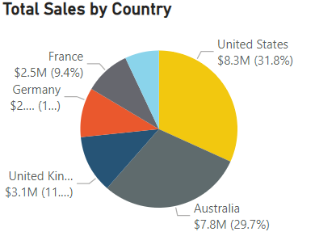

# AdventureWorks_PowerBI_Sales_Reports

## Overview  
This project automates reporting for AdventureWorks Cycle, transitioning from static Excel reports to dynamic Power BI dashboards. The solution delivers timely, detailed, and interactive insights for the CEO and stakeholders to make informed business decisions.

## Business Scenario  
- **Current State**: Bi-monthly Excel-based sales reports.  
- **Objective**: Provide daily sales reports with automated data updates, interactive visualizations, and enhanced accessibility.  
- **Outcome**: Streamlined reporting process and improved decision-making.

## Features  
1. **Data Import & Transformation**  
   - Imported data from Excel and cleaned using Power Query.  
   - Combined and transformed datasets into an optimized format.  

2. **Data Modeling & DAX**  
   - Established relationships and created hierarchies in the data model.  
   - Utilized DAX for custom calculations and time intelligence.

3. **Visualizations**  
   - Created interactive charts, tables, and slicers to analyze KPIs like sales trends and regional performance.  
   - Implemented advanced features: drill-throughs, custom tooltips, and conditional formatting.  

4. **Power BI Service**  
   - Published reports and created a collaborative dashboard.  
   - Set up alerts and enabled sharing with stakeholders.

5. **Security**  
   - Implemented Row-Level Security (RLS) to restrict data access based on user roles.  

## Key Dashboards  

 

## Tools & Technologies  
- **Power BI Desktop**  
- **DAX** for calculations  
- **Power Query Editor** for data transformation  
- **Power BI Service** for collaboration  
